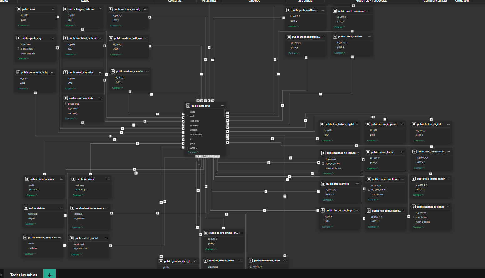
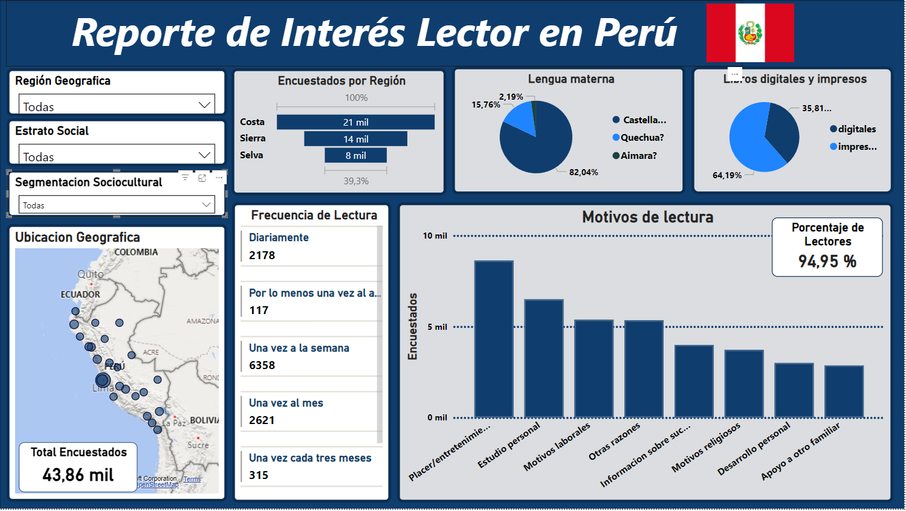

# Proyecto
Este proyecto (aun en proces), busca generar varios productos que pueden ser utiles para el analisis de los datos, clusterizacion y posibles proyecciones a modelos de machine learning que se puedan añadir. La data corresponde al 2022 y contiene registros sobre cararisticas lectoras en diferentes locaciones del peru. Al ser un dataset demasiado extenso no se especificaran las columnas aqui, puedes encontrar todas las columnas con sus descripciones en './in/04_Diccionario_Variables_ENL2022.pdf'.

Los productos que se desea desarrollar son los siguientes

## Producto 1: Base de datos (modelo relacional en postgresql)
Diseño de un modelo relacional para los datos obtenidos (en postgressql). En './models/database_postgressql' se esta almacenando las querys necesarias para poder replicar este modelo relacional

La numeracio indica el orden de ejecucion para la replicacion, empezando por la creacion de la tabla general, la insercion de la data, y los siguientes archivos se encargan de la creacion de tablas secundarias que ayudaran a la comprension contextual de la data que se encontraba muy disgregada. El resultado final se puede visualizar aqui:

Si bien contamos con mas de 30 tablas, estas pueden expresar informacion exacta de cada persona encuestada, ya sea sexo, etnia, ubicacion, lenguajes que habla, condiciones de comprension entre muchas otras. Ayudandonos de herramientas como PowerBy podemos obtener visualizaciones interesantes de esta data

## Producto 2: Dasaboard 'Reporte de Interés Lector en Perú'
- Diseño de un dashboard usando como fuente de datos nuestro modelo relacional, del gran bagaje de informacion a la mano se decidio enfocar el proyecto a data relacionada con los intereses de lectura. Los filtros aplican segmentaciones a la Region Geografica, Estrato Socioeconomico y Segmentacion cultural. Para mas informacion sobre el dashboard puedes revisar la informacion detallada en [dashboard.md](dashboard.md)

### Insights
1. Sin importar la segmentacion por Region o Sociocultural (edades), el estrato social Rural presenta una preferencia por la lectura de libros impresos. Siendo su valor maximo de un 87% para la region Selva
2. La principal motivacion para la lectura es 'Placer/Entretenimiento'. Solo variando para la segmentacion sociocultural referente a 'Educacion Universitaria' en la cual sus motivos de lectura son de 'Estudio Personal'
3. La categoria frecuencia de lectura dominante de los encuestas es de 'Una vez a la semana' como minimo, sin importar la segmentacion aplicada
4. Mas de el 90% de los encuestados indicaron ser lectores ocacionales
5. Si bien la lengua predominante en toda la nacion es el Castellano, esta presenta mayor recuerrencia en la region costa y selva. En cuanto a region sierra tambien se encuentra como la lengua materna dominante, visualizando un aumento del habla de lenguas indigentas como Quechua o Aimara
6. La mayor cantidad de encuestados son de region costa (esto podria ser un posible sesgo de informacion para posibles conclusiones)

## Producto 3
- Aplicacion de clustering para extraccion de mas conclusiones y posible extrapolacion a un modelo de machine learning

## LOGROS
Aqui vamos a mencionar los logros que se iran alcanzando de forma personal cada vez que avance en el proyecto

### Producto 1
- Extraccion y modificacion de data cruda de manera sistematica (aplicando python './1_data_explore.ipynb'). Generando un nuevo csv con la data lista para un mejor uso ('./out/data_modificada.csv)
- Generacion sistematica de querys para la creacion de tablas (usando funciones en python) que serviran a nuestro modelo relaciona. Revisar '2_posgress.ipynb' y '3_formato_tablas.ipynb'
- Primeros bosquejos del modelo relacional (aplicando querys de sql).
