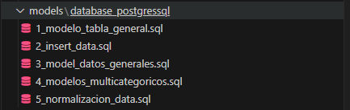

# Proyecto
Este proyecto (aun en proces), busca generar varios productos que pueden ser utiles para el analisis de los datos, clusterizacion y posibles proyecciones a modelos de machine learning que se puedan añadir. La data corresponde al 2022 y contiene registros sobre cararisticas lectoras en diferentes locaciones del peru. Al ser un dataset demasiado extenso no se especificaran las columnas aqui, puedes encontrar todas las columnas con sus descripciones en './in/04_Diccionario_Variables_ENL2022.pdf'.

Los productos que se desea desarrollar son los siguientes

## Producto 1
- Diseño de un modelo relacional para los datos obtenidos (en postgressql). En './models/database_postgressql' se esta almacenando las querys necesarias para poder replicar este modelo relacional

## Producto 2
- Diseño de un dashboard usando como fuente de datos nuestro modelo relacional

## Producto 3
- Aplicacion de clustering para extraccion de mas conclusiones y posible extrapolacion a un modelo de machine learning

## LOGROS
Aqui vamos a mencionar los logros que se iran alcanzando de forma personal cada vez que avance en el proyecto

### Producto 1
- Extraccion y modificacion de data cruda de manera sistematica (aplicando python './1_data_explore.ipynb'). Generando un nuevo csv con la data lista para un mejor uso ('./out/data_modificada.csv)
- Generacion sistematica de querys para la creacion de tablas (usando funciones en python) que serviran a nuestro modelo relaciona. Revisar '2_posgress.ipynb' y '3_formato_tablas.ipynb'
- Primeros bosquejos del modelo relacional (aplicando querys de sql).
